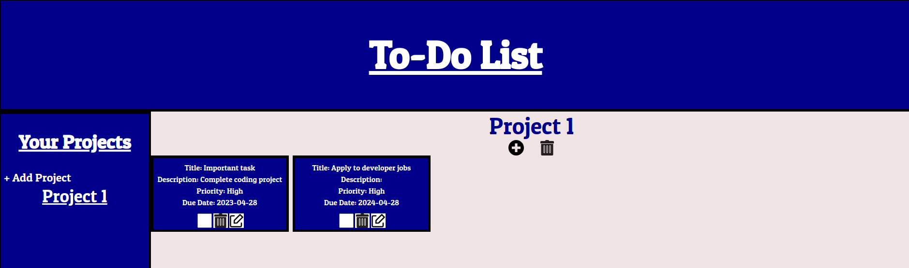
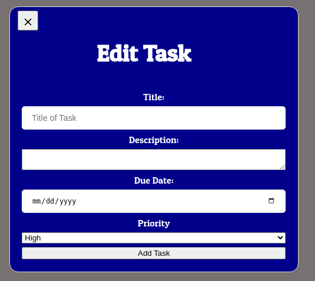
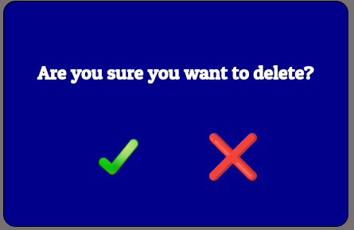
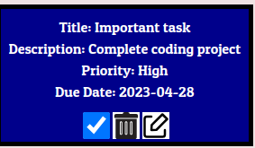
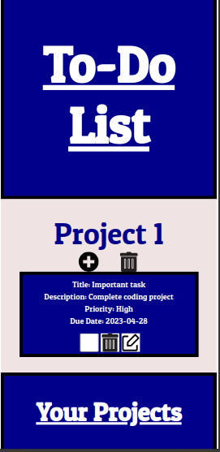
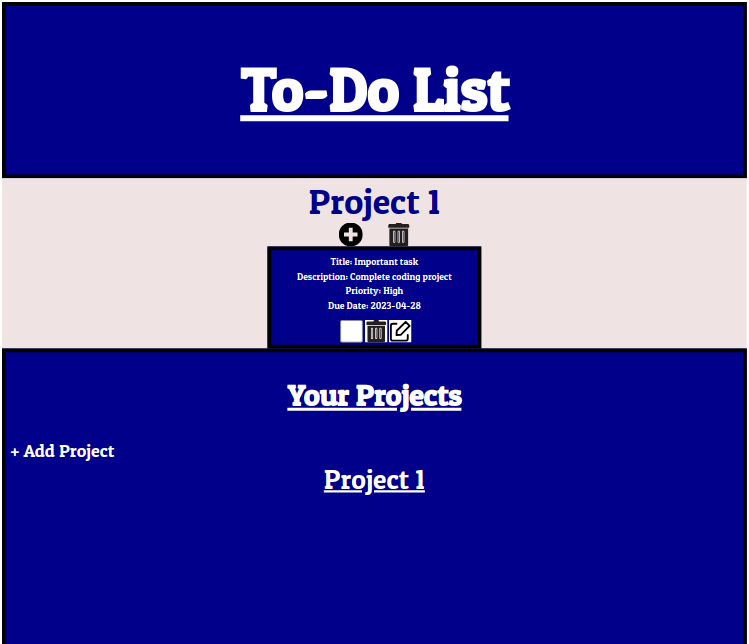

<h1>About This Project</h1> 
CRUD application that empowers users to effectively organize projects and tasks. Users can create new projects, manage tasks within each project, and make updates effortlessly. The application is mobile responsive, ensuring smooth operation across any screen size. Created using JavaScript, HTML, SCSS, Sass, Local Storage, and Webpack.

<br> 

<h1>What I learned</h1>
    <ul>
   <li>Utilized local storage for persistent todo task management across page loads</li>
<li>Users can create new projects and add todo list items within the project. Users can delete projects and task items. They can also mark tasks complete and edit them.</li>
<li>Implemented modules for improved code organization and maintainability</li>
<li>Expanded DOM manipulation skills and element querying methods</li>
<li>Utilized factory functions for streamlined object creation</li>
<li>Enhanced understanding of Object-Oriented Programming (OOP) principles for cleaner and more efficient code</li>
<li>Acquired proficiency in using and configuring code bundlers such as webpack</li>
<li>Learned techniques for parsing and converting JSON data into JavaScript objects</li>
    </ul>

 <h1>Built With</h1>

 
  
 
  
 


<h1>Getting Started</h1>

To get project cloned locally: git clone git@github.com:alecnissen/Todo-List.git

then ``` npm install ``` which will install all dependency's and packages.

<h1>Features</h1>

- Users can create projects, add todo items within each project, while also deleting, marking complete, and editing tasks. User can also delete entire projects.



<br>

<br>


- Local storage which will ensure that projects and their specific todo tasks persist across page reloads. 

- Gained exposure to SASS/SCSS for better code organization and structure

- Mobile responsive works on tablets and phones.






<h1>Acknowledgments</h1> Thank you to everyone within The Odin Project Curriculum from the bottom of my heart! Thank you to anyone who helped me in the discord channels. I promise to help others throughout this journey. 

<h1>Contact</h1>

Creator: Alec J Nissen 
<br>
E-Mail: alecnissen@yahoo.com
<br>
GitHub: https://github.com/alecnissen/Todo-List
<br>
Live Link: https://alecnissen.github.io/Todo-List/
